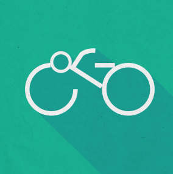
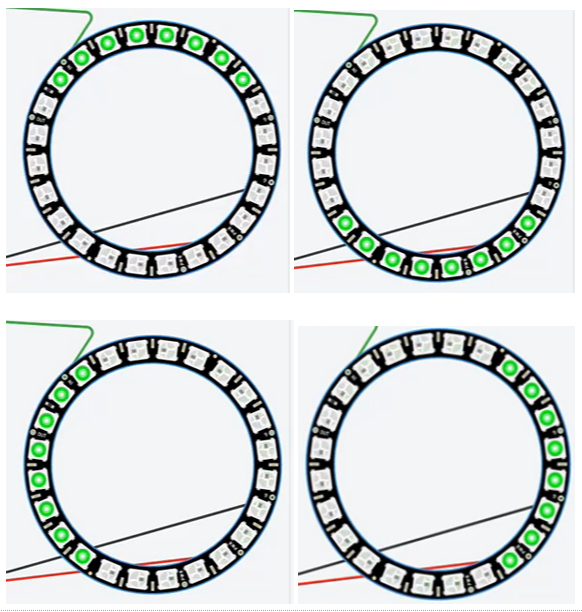
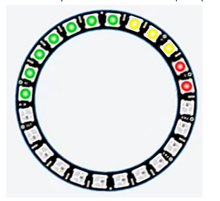
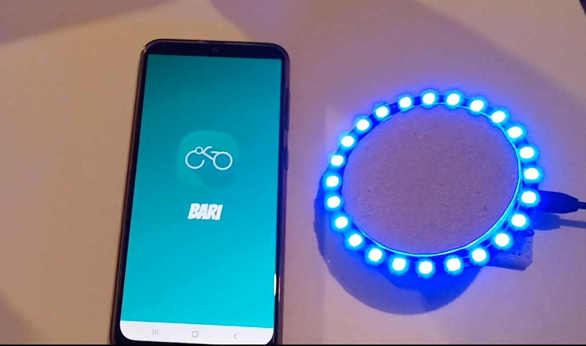
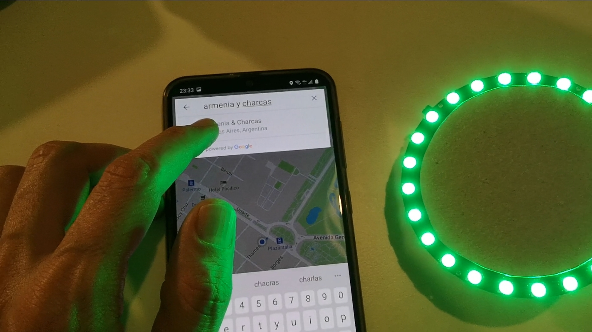
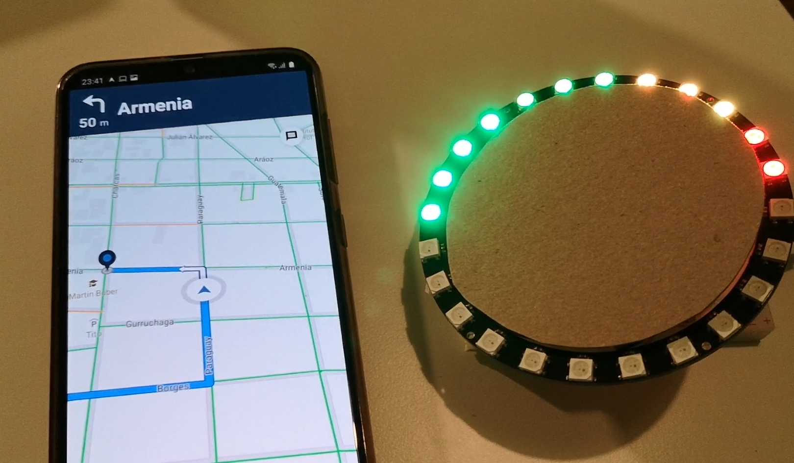
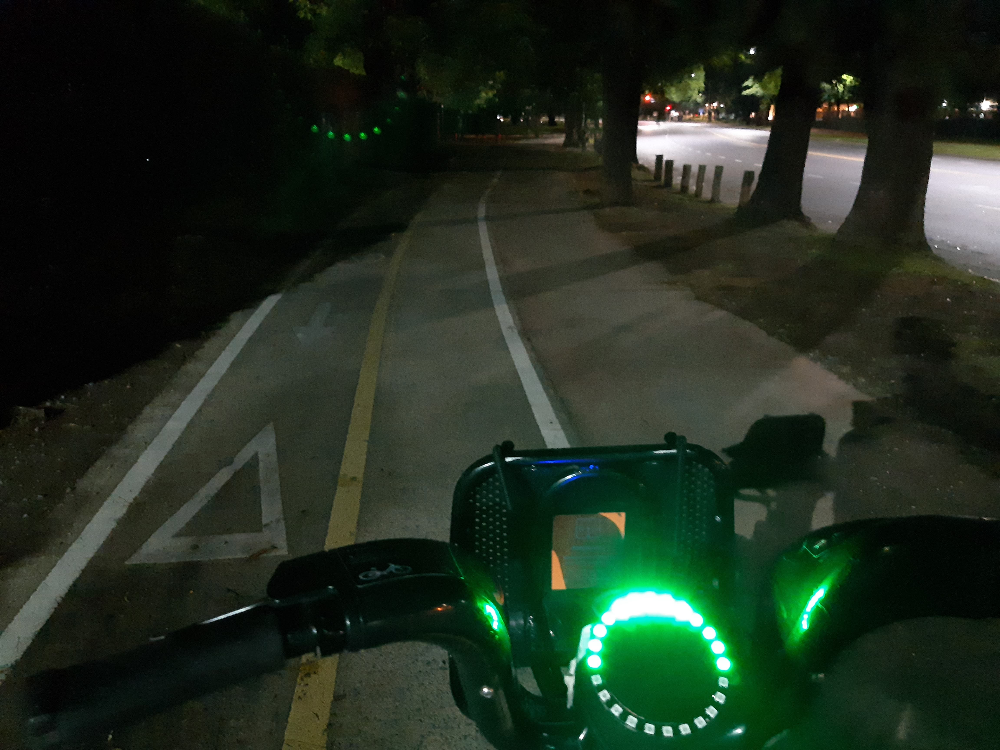
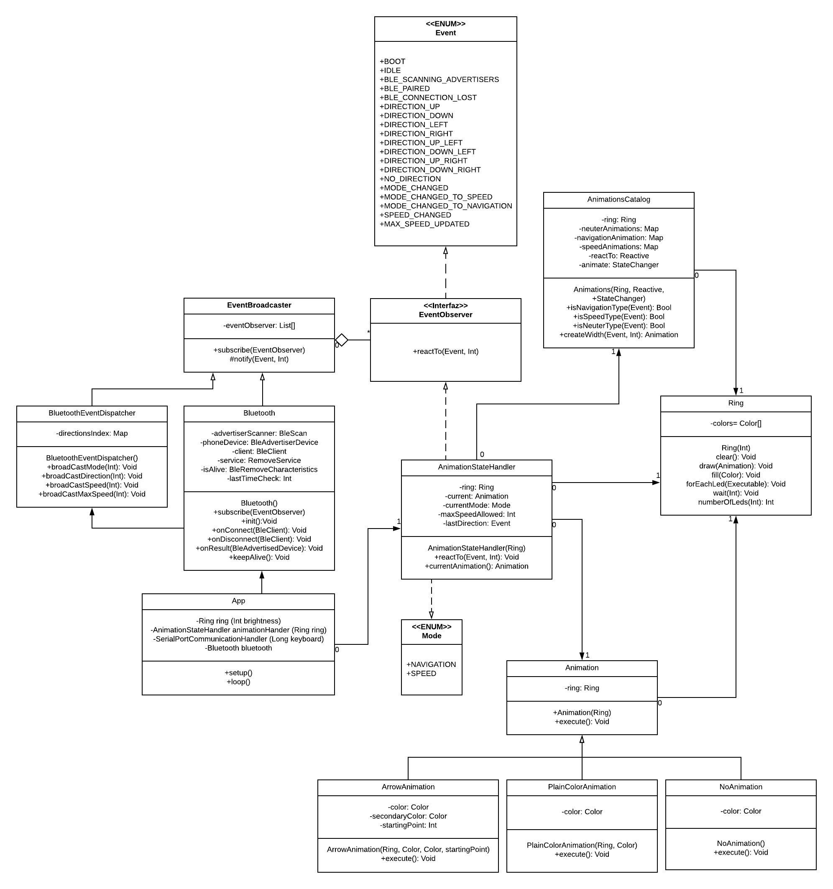
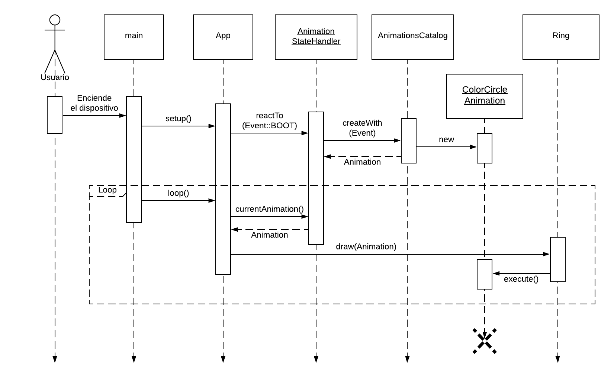
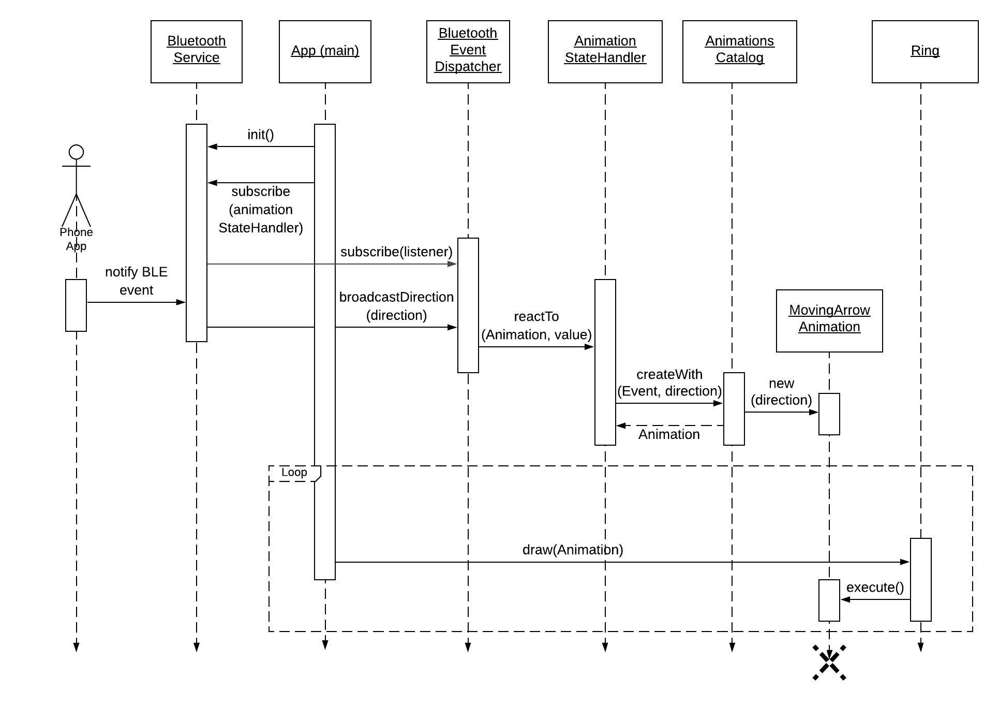

# Bike Device

The purpose of this code is to guide a biker using a ring of leds in the handlebars of the bike. 

So, you can see arrow indications after pairing with a cellphone app. And a speedometer. And potentially a chronometer if you wish to code that too. 

### Directions

### Speedometer

## Board, chip and framework

Code is written for a `NodeMCU` board, with a `ESP32` with `BLE` chip. And the `Adafruit LED Ring`. 

However, apart from the BLE library we use, the rest of the code should work on arduino too.

The framework we chose was Arduino, just because it has a great community. But apart from `setup` & `loop` main functions, we don´t actually make much use of it.

Preferred development environment is `platformio`, integrated to any IDE you would chose.

## How to run

For `Arduino IDE`, open `src/src.ino`. And install `FastLed` library.

For other IDEs, like `VSCode` or `CLion`, you can run the `main.cpp` file. You'll have to install a couple of dependencies though, using `platformio`.

## Screenshots

## Class diagram

Approximated design (changed over time)

## Sequence diagrams

### Boot

### Bluetooth Event

